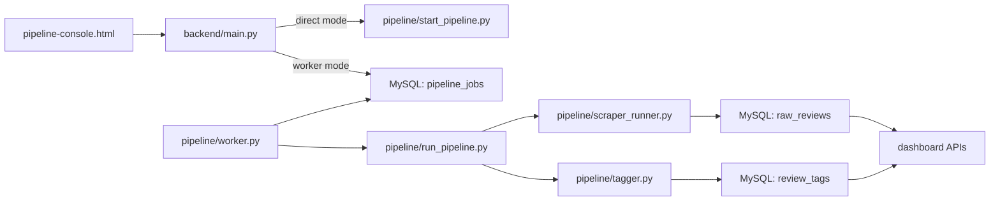

# Amazon VOC Dashboard

Voice of Customer analytics for Amazon.in products.

This repo does four things:

- scrape Amazon reviews with Selenium + Chrome
- tag each review with sentiment, primary categories, and sub-tags
- store analytics data in MySQL
- expose a React dashboard for CXO and analyst use

This repo is optimized for Windows + MySQL + Vite (React) + FastAPI.

## Plain-English Overview

Think of this setup as 3 separate parts:

1. Dashboard
- this is the read-only analytics website
- CXO and analysts open this to view insights

2. Analyst Run Page
- this is where analysts trigger the review refresh
- use `pipeline-console.html`

3. Scraping Worker
- this is the machine that actually opens Chrome, logs into Amazon, fetches reviews, and tags them
- for production, this should be a Windows machine

### Who uses what

- CXO:
  - open the main dashboard only
- Analyst:
  - open `pipeline-console.html`
- Admin / you:
  - deploy the dashboard
  - configure the database
  - keep the Windows worker machine running

### The simplest mental model

- local Windows mode:
  - everything can run on one machine
- production mode:
  - Linux server hosts the dashboard
  - remote MySQL stores the data
  - Windows worker does the scraping

### Important current requirement

For worker mode to function, the database user must have access to:

- `pipeline_jobs`
- `pipeline_workers`

Those tables are already included in `ops/mysql/mysql_setup.sql`.

## Repo Structure

```text
amazon-reviews-scraper/
|-- .env
|-- .env.production
|-- data/
|   |-- asins.csv
|   `-- categories.json
|-- backend/
|   |-- main.py
|   |-- requirements.txt
|   `-- Dockerfile
|-- pipeline/
|   |-- start_pipeline.py
|   |-- run_pipeline.py
|   |-- scraper_runner.py
|   |-- scraper.py
|   |-- tagger.py
|   |-- worker.py
|   |-- requirements.txt
|   `-- utils/taxonomy.py
|-- frontend/
|   |-- index.html
|   |-- weekly-run.html
|   |-- pipeline-console.html
|   |-- package.json
|   |-- vite.config.js
|   |-- nginx.conf
|   `-- src/
|-- ops/
|   |-- mysql/mysql_setup.sql
|   |-- deploy/
|   |   |-- local-docker.md
|   |   `-- production.md
|   `-- windows/
|       |-- start_pipeline_worker.ps1
|       `-- register_pipeline_worker_task.ps1
|-- shared/
|   `-- env.py
|-- docker-compose.local.yml
`-- docker-compose.prod.yml
```

## Frontend Surfaces

There are 2 separate frontend surfaces:

- Dashboard: analytics UI only, no pipeline controls
- Pipeline Console: the single analyst page for running the pipeline, custom runs, ASIN management, and category management

## Environment Selection

- normal local Python runs load `.env`
- local Docker injects `.env` and sets `APP_ENV=local`
- production Docker injects `.env.production` and sets `APP_ENV=production`
- if you need an explicit override outside Docker, set `APP_ENV_FILE` to a specific env file path before starting Python

## URLs

Local `uvicorn` + Vite:

- Dashboard: `http://localhost:5173`
- Pipeline Console: `http://localhost:5173/pipeline-console.html`

Local Docker:

- Dashboard: `http://localhost:8080`
- Pipeline Console: `http://localhost:8080/pipeline-console.html`

Production Docker:

- Dashboard: `http://<server>/`
- Pipeline Console: `http://<server>/pipeline-console.html`

## Local Run

### Option 1: normal local development

Terminal 1:

```powershell
cd .\backend
uvicorn main:app --reload --port 8000
```

Terminal 2:

```powershell
cd .\frontend
npm run dev
```

Stop:

- `Ctrl+C` in the backend terminal
- `Ctrl+C` in the frontend terminal

This mode is the simplest way to run the full app on one Windows machine, including direct UI-triggered pipeline runs.

### Option 2: local Docker

Optional build only:

```powershell
docker compose -f docker-compose.local.yml build
```

Start:

```powershell
docker compose -f docker-compose.local.yml up -d
```

Build and start:

```powershell
docker compose -f docker-compose.local.yml up -d --build
```

Check status:

```powershell
docker compose -f docker-compose.local.yml ps
```

Stop:

```powershell
docker compose -f docker-compose.local.yml down
```

### Local scraping

If you are using normal local `uvicorn` + `npm run dev`, the Pipeline Console can trigger the pipeline directly on that Windows machine.

You can also run scraping manually:

```powershell
py .\pipeline\scraper_runner.py
py .\pipeline\tagger.py
```

Or:

```powershell
py .\pipeline\run_pipeline.py
```

### Local Docker notes

- uses your existing `.env`
- overrides `DB_HOST` to `host.docker.internal` by default
- if MySQL is remote, set `DOCKER_DB_HOST`
- the dashboard stays pipeline-free
- use `/pipeline-console.html` for analyst pipeline operations
- actual Selenium scraping is still best run on a Windows machine, not inside the Linux Docker container
- if you want click-to-run from the Docker-hosted analyst pages, connect a Windows worker as described below

## Production Run

Cheapest practical production setup:

- one low-cost Linux VM
- remote MySQL
- Docker Compose
- frontend served by Nginx
- backend served by Uvicorn
- one separate Windows worker machine for scraping

Required production files:

- `backend/Dockerfile`
- `frontend/Dockerfile`
- `frontend/nginx.conf`
- `docker-compose.prod.yml`
- `.env.production`

### Production quickstart

1. Provision remote MySQL.
2. Run `ops/mysql/mysql_setup.sql`.
3. Fill `.env.production`.
4. On the Linux VM, run:

```bash
docker compose -f docker-compose.prod.yml up -d --build
```

Useful commands:

```bash
docker compose -f docker-compose.prod.yml ps
docker compose -f docker-compose.prod.yml logs -f
docker compose -f docker-compose.prod.yml down
docker compose -f docker-compose.prod.yml up -d --build
```

## Minimal Worker Setup

This is the setup that removes terminals from the analyst workflow.

### Why it exists

The production Docker app can serve the dashboard and analyst pages, but reliable Amazon scraping still needs a browser-capable Windows machine with your Chrome profile and Amazon login session.

So the minimal worker model is:

- Linux VM hosts the dashboard/backend
- Windows worker machine runs `pipeline/worker.py`
- analyst uses `pipeline-console.html`
- backend enqueues a job in MySQL
- Windows worker picks the job, runs the scraper/tagger, and updates status

### What the analyst sees

On the Pipeline Console page:

- current data freshness
- whether a worker is connected
- latest queued/running/completed job
- run controls and product/category management

The analyst does not need to open a terminal once the worker is installed and kept running.

### Worker setup on the Windows machine

Clone the repo on the Windows browser-capable machine and configure `.env` for the same remote MySQL used by production.

Start the worker manually:

```powershell
py .\pipeline\worker.py
```

Or use the helper script:

```powershell
powershell -ExecutionPolicy Bypass -File .\ops\windows\start_pipeline_worker.ps1
```

To register a scheduled task so the worker starts automatically at logon:

```powershell
powershell -ExecutionPolicy Bypass -File .\ops\windows\register_pipeline_worker_task.ps1
```

### Worker env requirements

The worker machine needs:

- `.env` pointing to the same remote MySQL
- `CHROME_PROFILE` pointing to the local Windows Chrome profile folder
- a valid Amazon login session in that profile
- Python dependencies installed
- Chrome available on that machine

### Queue model

The worker model uses these database tables:

- `pipeline_jobs`
- `pipeline_workers`

They are already included in `ops/mysql/mysql_setup.sql`.

## Setup

### 1. Prereqs

- Python 3.10+
- Node 18+
- MySQL 8+ or compatible MariaDB
- Google Chrome installed for Selenium

### 2. Create `.env`

Example:

```env
DB_HOST=localhost
DB_USER=your_mysql_user
DB_PASSWORD=your_mysql_password
DB_NAME=voc
OPENAI_API_KEY=sk-...
ALLOWED_ORIGINS=http://localhost:5173,http://localhost:3000
CHROMEDRIVER_PATH=
CHROME_PROFILE=C:\amazon_profile
PIPELINE_EXECUTION_MODE=auto
```

### 3. Fill `.env.production`

Example production shape:

```env
DB_HOST=your-remote-mysql-host
DB_USER=llm_reader
DB_PASSWORD=replace_with_real_password
DB_NAME=world
OPENAI_API_KEY=replace_if_summary_generation_is_needed
ALLOWED_ORIGINS=http://your-server-ip,http://your-domain
PIPELINE_EXECUTION_MODE=worker
```

### 4. Add products to scrape

Edit `data/asins.csv`, or use the Pipeline Console page to add ASINs and categories.

### 5. Create MySQL tables

Recommended:

- use `ops/mysql/mysql_setup.sql`

That file is intended to be the from-scratch setup script for DevOps. It creates:

- database `world`
- app user `llm_reader` for both `%` and `localhost`
- all required app tables
- pipeline queue tables
- the seed row for `pipeline_runs`

Core tables expected by the app:

- `raw_reviews`
- `review_tags`
- `pipeline_runs`
- `pipeline_jobs`
- `pipeline_workers`
- `product_summaries`
- `product_ratings_snapshot`

### 6. Install dependencies

```powershell
py -m pip install -r .\backend\requirements.txt
py -m pip install -r .\pipeline\requirements.txt
cd .\frontend
npm install
```

## How the product works now

### Dashboard tabs

- Overview: portfolio KPIs, issue priorities, customer strengths, and summary tables
- Reviews: sortable tagged reviews table with CSV export
- Trends: CXO daily trends, rating movement, issue watchlists, and product comparisons

### Pipeline page

- Pipeline Console (`/pipeline-console.html`): analyst page for run setup, product selection, ASIN add/update, and category management

### Running the pipeline from the UI

There are two execution modes:

- direct mode
- worker mode

Direct mode:

- used automatically on a Windows host when `PIPELINE_EXECUTION_MODE=auto`
- backend launches `pipeline/start_pipeline.py`
- good for local single-machine usage

Worker mode:

- used automatically on non-Windows when `PIPELINE_EXECUTION_MODE=auto`
- recommended for production via `PIPELINE_EXECUTION_MODE=worker`
- backend writes a job to `pipeline_jobs`
- Windows worker polls, claims, runs, and updates status

## Pipeline Data Flow



## Backend API

Main endpoints under `/api`:

- `GET /api/reviews`
- `GET /api/filters`
- `GET /api/stats`
- `GET /api/analysis`
- `GET /api/summary`
- `GET /api/trends/cxo`
- `GET /api/trends/rating`
- `GET /api/wordcloud`
- `GET /api/reviews/by-keyword`
- `GET /api/pipeline/status`
- `GET /api/pipeline`
- `GET /api/pipeline/capabilities`
- `GET /api/pipeline/jobs`
- `GET /api/pipeline/jobs/{job_id}`
- `POST /api/pipeline/run`
- `GET /api/asins`
- `POST /api/asins`
- `GET /api/categories`
- `POST /api/categories`

## Configuration Reference

Environment variables:

- `DB_HOST`, `DB_USER`, `DB_PASSWORD`, `DB_NAME`: MySQL connection
- `OPENAI_API_KEY`: required for tagging and summary generation
- `ALLOWED_ORIGINS`: CORS origins
- `CHROME_PROFILE`: Chrome user data directory used by Selenium
- `CHROMEDRIVER_PATH`: optional explicit chromedriver path
- `SCRAPE_DAYS_BACK`: runtime override used by pipeline run
- `SCRAPE_ASINS`: runtime override used by pipeline run
- `PIPELINE_EXECUTION_MODE`: `auto`, `direct`, or `worker`
- `PIPELINE_WORKER_TIMEOUT_SECONDS`: worker heartbeat timeout for capability checks
- `PIPELINE_WORKER_ID`: optional explicit worker ID on the Windows worker machine

## Troubleshooting

### `localhost:8080` does not open

You probably ran:

```powershell
docker compose -f docker-compose.local.yml build
```

That only builds images. Start the stack with:

```powershell
docker compose -f docker-compose.local.yml up -d
```

### Pipeline page on `5173` does not work

Use the Vite local URLs:

- `http://localhost:5173/pipeline-console.html`

`8080` is only for the Docker/Nginx stack.

### Pipeline page says no worker is connected

That means the backend is in worker mode and has not seen a recent heartbeat in `pipeline_workers`.

Start the Windows worker:

```powershell
py .\pipeline\worker.py
```

Or register the scheduled task:

```powershell
powershell -ExecutionPolicy Bypass -File .\ops\windows\register_pipeline_worker_task.ps1
```

### Scraper opens Chrome but inserts 0 reviews

- ensure Amazon is actually logged in in the Chrome profile being used
- ensure `CHROME_PROFILE` points to a valid writable local folder
- Amazon may load slowly or challenge the session

### Tagger runs but nothing gets tagged

- ensure `OPENAI_API_KEY` is set
- ensure `review_tags.review_id` matches `raw_reviews.review_id`
- the tagger only processes untagged rows

### Ratings/trend dates look wrong

Review-derived trends use parsed `review_date`.
Amazon overall rating snapshots still use snapshot scrape dates, which is expected.

## Notes

- the dashboard and pipeline operations are intentionally separated
- analysts should use `pipeline-console.html`
- the executive dashboard stays clean and read-only
- the cheapest reliable production model is dashboard on Linux VM plus worker on Windows
